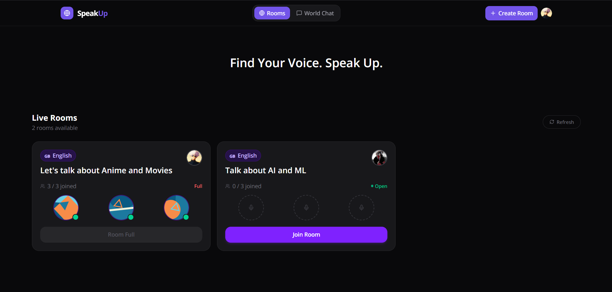

<br />
<div align="center">

# SpeakUp 🎙️

<p align="center">
  A real-time language practice platform where users can create voice rooms, connect with people worldwide, and improve their speaking skills through live conversations.
  <br />
  <br />
  <a href="https://speak-up.online"><strong>Explore the App »</strong></a>
  <br />
  <br />
  <a href="https://speak-up.online">Live Demo</a>
  ·
  <a href="https://github.com/aakashsaini09/SpeakUp/issues">Report Bug</a>
  ·
  <a href="https://github.com/aakashsaini09/SpeakUp/issues">Request Feature</a>
</p>

</div>

---

## 📸 Screenshots

<p align="center">
  
</p>

---

## ✨ Features

- 🎙️ Real-time voice communication using WebRTC
- 🌎 Global community chat
- 🏠 Create and join language-specific rooms
- 👥 Live participant tracking
- 🔄 Real-time updates with Socket.IO
- 🔐 Authentication with Clerk
- 🧹 Automatic cleanup of inactive rooms
- 📱 Responsive design for desktop and mobile

---

## 🚧 Challenges & Learnings

This project pushed me into technologies I had never worked with before, especially WebRTC and real-time communication systems.

Some of the challenges included:

- Implementing WebRTC peer-to-peer audio connections
- Managing SDP offer/answer exchange
- Handling ICE candidate signaling through Socket.IO
- Synchronizing live participants across rooms
- Managing room lifecycle and cleanup
- Deploying and configuring Clerk webhooks in production

---

## 🛠️ Tech Stack

### Frontend

- Next.js
- TypeScript
- Tailwind CSS
- Clerk Authentication
- Socket.IO Client
- WebRTC

### Backend

- Node.js
- Express.js
- MongoDB
- Socket.IO
- Clerk Webhooks

---

## 📂 Project Structure

```bash
SpeakUp
│
├── frontend/
│   └── Next.js Application
│
└── backend/
    └── Express + Socket.IO Server
````

---

## ⚙️ Environment Variables

### Frontend (.env)

```env
NEXT_PUBLIC_CLERK_PUBLISHABLE_KEY=
CLERK_SECRET_KEY=
NEXT_PUBLIC_BACKEND_URL=
```

### Backend (.env)

```env
CLERK_WEBHOOK_SECRET=
CLERK_SECRET_KEY=
MONGO_URL=
PORT=3001
```

---

## 🚀 Local Setup

### Clone Repository

```bash
git clone https://github.com/aakashsaini09/SpeakUp.git
cd SpeakUp
```

### Install Dependencies

Frontend

```bash
cd frontend
npm install
```

Backend

```bash
cd backend
npm install
```

---

## ▶️ Run Backend

```bash
cd backend
npm run dev
```

---

## ▶️ Run Frontend

```bash
cd frontend
npm run dev
```

---

## 🔗 LocalTunnel Setup (Required for New User Registration)

Open a third terminal:

```bash
cd backend
lt --port 3001
```

A LocalTunnel URL will be generated:

```bash
https://example.loca.lt
```

Open the generated URL in your browser and complete the verification process.

Then create a Clerk webhook:

```bash
https://example.loca.lt/api/clerk/webhook
```

This is only required when testing new user registration locally.

---

## 🌐 Live Demo

https://speak-up.online

---

## 🔮 Future Improvements

* 🎥 Video Calling
* 🤝 Friend System
* 💬 Direct Messaging
* 🛡️ Room Moderation
* 🏆 User Profiles
* 🎯 Language Matching
* 🔊 Improved Audio Quality

---

## 👨‍💻 Author

**Aakash Saini**

* Portfolio: https://aakashsaini.in
* LinkedIn: https://www.linkedin.com/in/-aakashsaini/
* GitHub: https://github.com/aakashsaini09

---

<div align="center">

Made with ❤️ using Next.js, Socket.IO and WebRTC

</div>
```
