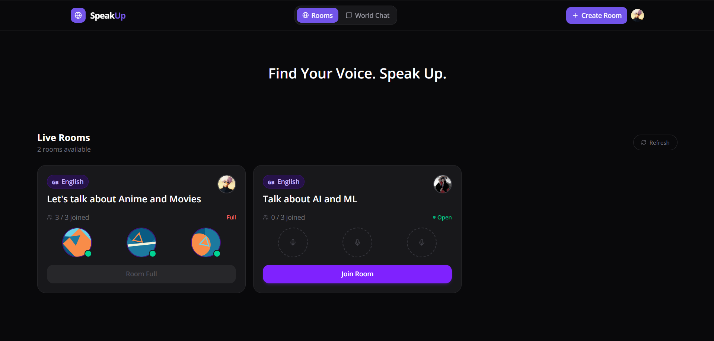

<br />

<div align="center">

# SpeakUp 🎙️

<p align="center">
  A real-time language learning and communication platform where users can create rooms,
  practice languages through live conversations, connect with people worldwide,
  and build meaningful social connections.
  <br />
  <br />
  <a href="https://speak-up.online"><strong>Explore the App »</strong></a>
  <br />
  <br />
  <a href="https://speak-up.online">Live Demo</a>
  ·
  <a href="https://github.com/aakashsaini09/Speak-Up/issues">Report Bug</a>
  ·
  <a href="https://github.com/aakashsaini09/Speak-Up/issues">Request Feature</a>
</p>

</div>

---

## 📸 Screenshots

<p align="center">
  
</p>

---

## ✨ Features

### 🏠 Rooms & Language Practice

- 🏠 Create and join language-specific rooms
- 🌎 Discover rooms created by users around the world
- 🔎 Filter rooms based on language
- 👥 Live participant tracking
- 🎙️ Real-time voice communication using WebRTC
- 🎥 Live video communication
- 🖥️ Screen sharing
- 🛡️ Room administration and participant management
- 🚫 Room admins can remove participants from rooms
- 🧹 Automatic cleanup of inactive rooms
- 🤖 AI-powered room title generation

### 💬 Three Types of Chat

SpeakUp provides three different communication spaces:

#### 🏠 Room Chat

A temporary chat available inside each room.

- 💬 Real-time text messaging
- 🖼️ Image sharing
- 🎬 Video/media sharing
- ⚡ Real-time updates using Socket.IO
- 🧹 Messages and media are temporary and tied to the room lifecycle

#### 🌎 World Chat

A global community chat where users from across the platform can communicate and interact.

#### 💌 Personal Chat

Private one-to-one conversations between users.

- 👤 Chat directly with friends
- 💬 Persistent conversation history
- ⚡ Real-time messaging
- 📚 Access previous conversations from the Chat section

### 🤝 Social Network

SpeakUp includes a dedicated **Social Hub** for managing connections.

- ➕ Send friend requests
- ❌ Cancel sent requests
- ✅ Accept incoming requests
- 🚫 Reject incoming requests
- 👥 View friends
- ➡️ Follow users
- ↩️ Unfollow users
- ❌ Unfriend users
- 🔎 View all connections
- 📩 Manage incoming requests
- 💬 Start a personal conversation directly from a user's profile

The Social Hub provides four main views:

- **All** — Friends + Following
- **Friends** — Users you are connected with
- **Following** — Users you follow
- **Requests** — Incoming friend requests

### 🔐 Authentication & User Management

- 🔐 Secure authentication using Clerk
- 👤 User profiles
- 🔄 Clerk webhook integration
- 🛡️ Protected backend routes
- 🔑 Token-based API authentication

### 📱 User Experience

- 📱 Responsive design for desktop, tablet, and mobile
- ⚡ Real-time UI updates
- 🎨 Modern and interactive interface
- 🔔 User feedback and notifications
- 🧭 Simple navigation between rooms, social connections, and chats

---

## 🏗️ Architecture

SpeakUp uses a full-stack architecture combining REST APIs, WebSockets, and WebRTC.

```text
                         ┌─────────────────────┐
                         │      User           │
                         │  Browser / Mobile   │
                         └──────────┬──────────┘
                                    │
                                    ▼
                         ┌─────────────────────┐
                         │   Next.js Frontend  │
                         │ React + TypeScript  │
                         └──────────┬──────────┘
                                    │
                     ┌──────────────┴──────────────┐
                     │                             │
                     ▼                             ▼
              ┌──────────────┐              ┌──────────────┐
              │   REST API   │              │  Socket.IO   │
              │   Express    │              │   Server     │
              └──────┬───────┘              └──────┬───────┘
                     │                             │
                     ▼                             ▼
              ┌──────────────┐              ┌──────────────┐
              │   MongoDB    │              │    WebRTC    │
              │   Database   │              │ Audio/Video  │
              └──────────────┘              └──────────────┘
                                                    │
                                                    ▼
                                             ┌──────────────┐
                                             │ TURN Server  │
                                             │   coTURN     │
                                             └──────────────┘

                     ┌──────────────────────────────┐
                     │       Cloudflare R2          │
                     │     Media/Object Storage     │
                     └──────────────────────────────┘